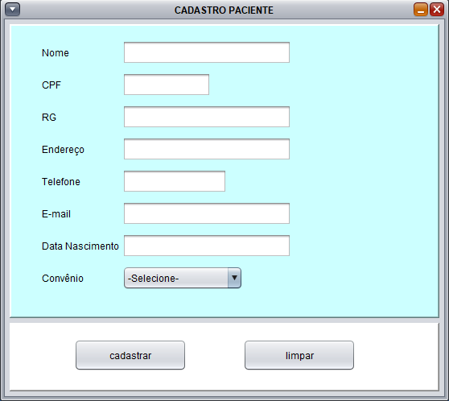
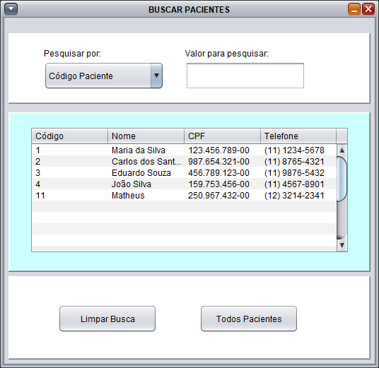
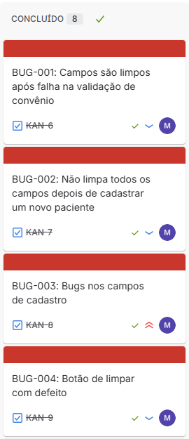
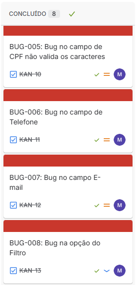
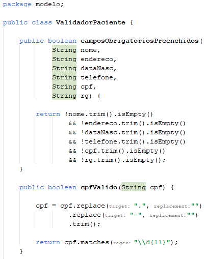
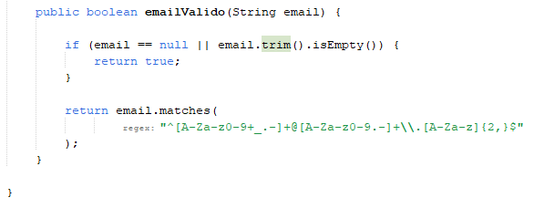
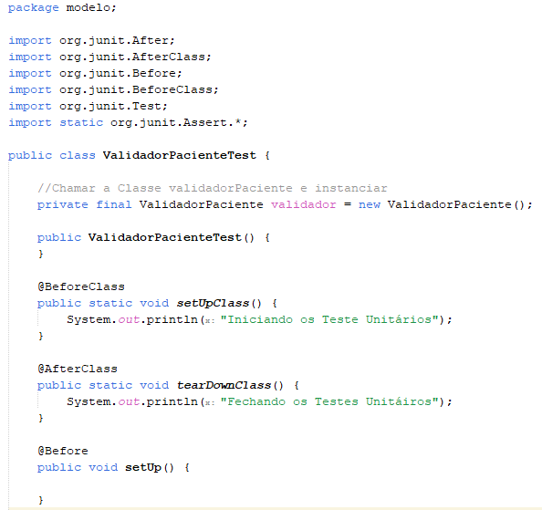
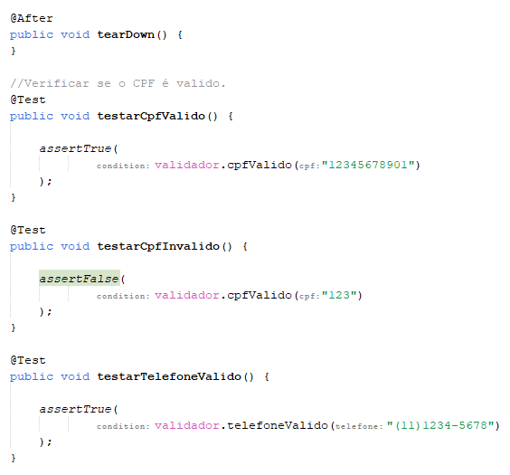
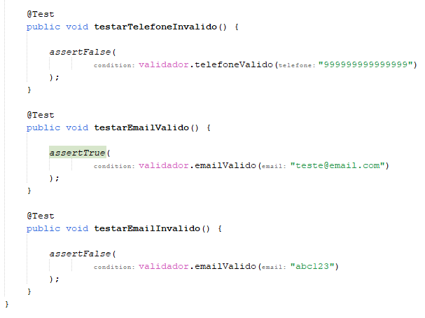
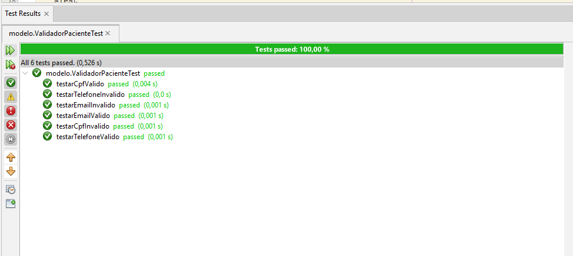

# Sistema Hospitalar - Correção de Bugs e Testes Unitários

## Sobre o Projeto

Este projeto foi desenvolvido como parte da disciplina de Estratégias de Teste de Software do curso Técnico em Desenvolvimento de Software.

O objetivo da atividade foi realizar a análise dos defeitos encontrados no sistema hospitalar, registrar os bugs no Jira, efetuar as correções necessárias e implementar testes unitários automatizados utilizando JUnit.

Além disso, foi utilizado Git e GitHub para controle de versão durante todo o processo de desenvolvimento.

---

## Tecnologias Utilizadas

* Java
* Java Swing
* MySQL
* Maven
* JUnit 4
* Jira
* Git
* GitHub

---

## Funcionalidades do Sistema

* Cadastro de pacientes
* Consulta de pacientes
* Busca por filtros
* Controle de convênios
* Validações de cadastro

---

## Estrutura do Projeto

```text
src/                    Código-fonte do sistema
banco/                  Script do banco de dados
screenshots/            Evidências da atividade
README.md               Documentação do projeto
```

---

## Banco de Dados

O script utilizado para criação do banco de dados encontra-se na pasta:

```text
banco/script_banco_sistema_hosp.sql
```

---

## Telas do Sistema

### Tela Principal


### Cadastro de Pacientes



### Busca de Pacientes



---

## Registro dos Bugs no Jira

Todos os defeitos identificados durante a execução dos testes foram registrados e acompanhados utilizando Jira.

<h3>Quadro Jira</h3>

<p align="center">
  
  
</p>

---

## Bugs Corrigidos

Durante a atividade foram analisados e corrigidos os seguintes defeitos:

* BUG-001 – Campos não devem ser limpos ao impedir o cadastro
* BUG-002 – Campos não eram limpos corretamente após cadastro
* BUG-003 – Cadastro permitindo campos obrigatórios vazios
* BUG-004 – Limpeza incompleta dos campos
* BUG-005 – Falta de validação do CPF
* BUG-006 – Falta de validação do telefone
* BUG-007 – Falta de validação do e-mail
* BUG-008 – Análise e validação do filtro por CPF

Todos os bugs foram retestados após as correções e marcados como concluídos no Jira.

---

## Implementação dos Testes Unitários

Para facilitar a realização dos testes unitários foi criada a classe:

```text
ValidadorPaciente
```

Responsável por centralizar as regras de validação utilizadas nos testes.

### Classe ValidadorPaciente





---

## Classe de Testes JUnit

Foi criada a classe:

```text
ValidadorPacienteTest
```

Responsável por validar as regras implementadas utilizando JUnit.

Foram criados testes para:

* CPF válido
* CPF inválido
* Telefone válido
* Telefone inválido
* E-mail válido
* E-mail inválido

### Classe ValidadorPacienteTest

<p align="center">
  
  
  
</p>

---

## Resultado dos Testes

Após a implementação e correção das validações, todos os testes unitários foram executados com sucesso.



---

## Controle de Versão

Durante o desenvolvimento da atividade foi utilizado Git e GitHub para registrar todas as alterações realizadas no projeto através de commits.

---

## Autor

Matheus Silva Melo

Curso Técnico em Desenvolvimento de Software

Senac EAD
